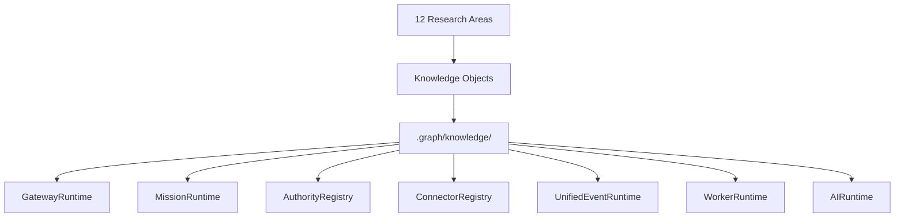

# Knowledge Object Index

## Object Types

| Type | Description | File |
|------|-------------|------|
| Constitutional Law | Immutable invariant governing all PING behavior | constitutional-laws.md |
| Pattern | Reusable organizational or architectural pattern | patterns.md |
| Capability | Business capability PING can express | capability-matrix.md |
| Business Observation | Fact discovered from research or audit | business-observations.md |
| Decision Rule | Deterministic rule for automated decision | decision-rules.md |
| Ontology | Entity definition with lifecycle/events/missions/relationships | ontology.md |

## Cross-Reference by Research Area

| Area | Laws | Patterns | Capabilities | Observations | Rules | Ontology |
|------|------|----------|--------------|--------------|-------|----------|
| 01 Browser Agent | 1,3 | 4,7 | 4 | 1,3 | 2 | — |
| 02 Multi-Agent | 2,4 | 1,2,3 | 2 | 2,5 | 1,5 | — |
| 03 Memory Systems | 5 | 8 | 3 | 6,7 | 3 | — |
| 04 Knowledge Systems | 5 | 8,9 | 3 | 6,8 | 3,4 | — |
| 05 Business OS | 2,6 | 1,2,5 | 1 | 9,10 | 5,6,7 | 1-12 |
| 06 Industry Intel | — | 6 | 5 | 11 | 7,8 | 1-12 |
| 07 Decision Systems | 2,4 | 1,3 | 6 | 12 | 1,3,4 | — |
| 08 Workflow Systems | 3,5 | 2,4 | 2 | 2 | 2 | — |
| 09 Connector Universe | 1 | 7 | 4 | 1 | 2 | — |
| 10 AI Infrastructure | 5 | 9 | 6 | 6 | 3 | — |
| 11 Org Intelligence | 2,6 | 1,5 | 1 | 9,10 | 5,6 | 1-12 |
| 12 Business Ontology | 6 | 6 | 5 | 11 | 4,8 | 1-12 |

## Relationship to PING Architecture

## Usage

1. **Constitutional Laws** — invariants that PING must never violate. These are the highest-priority knowledge objects.
2. **Patterns** — reusable organizational templates that PING's mission system should express.
3. **Capabilities** — business primitives PING can expose. Each capability links to a PING component.
4. **Observations** — facts discovered during audit and research that inform priorities.
5. **Decision Rules** — deterministic rules suitable for automation in PING's mission scheduler.
6. **Ontology** — entity definitions that PING's event pipeline and knowledge graph must model.
