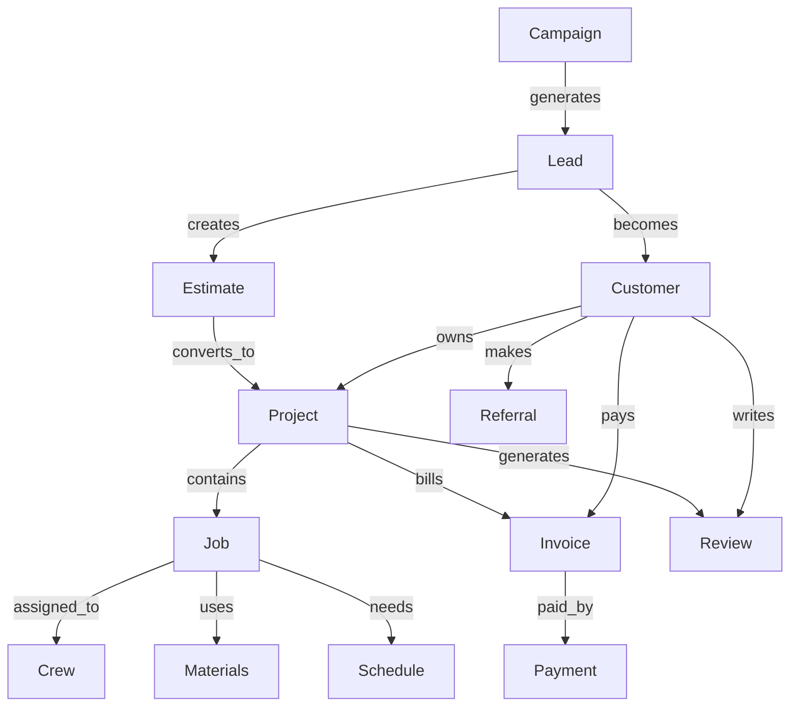

# Business Ontology

## Entity Catalog

### Customer

| Attribute | Value |
|-----------|-------|
| Lifecycle | lead → prospect → active → dormant → churned → referred |
| Key Events | CREATED, UPDATED, PROJECT_COMPLETED, REVIEWED, REFERRED, LOST |
| Key Missions | follow_up, send_review_request, re_engage, win_back |
| Relationships | owns Project, generates Lead, writes Review, makes Referral, pays Invoice |
| PING Component | CustomerAuthority (CRUD exists, no lifecycle) |

### Lead

| Attribute | Value |
|-----------|-------|
| Lifecycle | new → contacted → estimated → won → lost → nurtured |
| Key Events | CREATED, QUALIFIED, CONVERTED, LOST, REACTIVATED |
| Key Missions | qualify, schedule_estimate, follow_up, nurture, convert |
| Relationships | becomes Customer, generates Estimate, sourced from Campaign |
| PING Component | No LeadAuthority exists |

### Estimate

| Attribute | Value |
|-----------|-------|
| Lifecycle | draft → sent → viewed → accepted → expired → rejected |
| Key Events | CREATED, SENT, VIEWED, ACCEPTED, EXPIRED, REJECTED |
| Key Missions | build, send, follow_up, convert_to_project, re_estimate |
| Relationships | belongs_to Lead, converts_to Project, contains LineItem |
| PING Component | No EstimateAuthority exists |

### Project

| Attribute | Value |
|-----------|-------|
| Lifecycle | estimated → approved → scheduled → in_progress → completed → billed → reviewed |
| Key Events | CREATED, SCHEDULED, STARTED, COMPLETED, ARCHIVED |
| Key Missions | schedule, assign_crew, order_materials, send_invoice, request_review |
| Relationships | belongs_to Customer, contains Jobs, bills Invoice, generates Review |
| PING Component | ProjectAuthority (CRUD exists, no lifecycle) |

### Job / Work Order

| Attribute | Value |
|-----------|-------|
| Lifecycle | scheduled → dispatched → in_progress → completed → billed |
| Key Events | CREATED, DISPATCHED, STARTED, COMPLETED, TIME_LOGGED, PHOTO_CAPTURED |
| Key Missions | dispatch, navigate, execute, document, collect_payment |
| Relationships | part_of Project, assigned_to Technician, consumes Materials |
| PING Component | No JobAuthority exists |

### Crew / Technician

| Attribute | Value |
|-----------|-------|
| Lifecycle | idle → assigned → deployed → completed |
| Key Events | ASSIGNED, DEPLOYED, COMPLETED, UPDATED |
| Key Missions | dispatch, coordinate, debrief, certify |
| Relationships | assigned_to Job, contains Technician, drives Vehicle |
| PING Component | No CrewAuthority exists |

### Invoice

| Attribute | Value |
|-----------|-------|
| Lifecycle | draft → sent → overdue → paid → written_off |
| Key Events | CREATED, SENT, REMINDED, PAID, WRITTEN_OFF |
| Key Missions | send, follow_up, process_payment, reconcile |
| Relationships | bills Project, paid_by Customer, contains LineItems |
| PING Component | No InvoiceAuthority exists |

### Payment

| Attribute | Value |
|-----------|-------|
| Lifecycle | pending → processing → completed → failed → refunded |
| Key Events | INITIATED, PROCESSED, COMPLETED, FAILED, REFUNDED |
| Key Missions | process, reconcile, handle_failure, refund |
| Relationships | pays Invoice, from Customer, via PaymentMethod |
| PING Component | No PaymentAuthority exists |

### Review

| Attribute | Value |
|-----------|-------|
| Lifecycle | requested → received → responded → flagged → featured |
| Key Events | REQUESTED, RECEIVED, RESPONDED, FLAGGED, FEATURED |
| Key Missions | request, analyze, respond, moderate, feature |
| Relationships | about Project, written_by Customer, published_on Platform |
| PING Component | ReviewAuthority (CRUD exists, no lifecycle, review_flags table exists) |

### Campaign

| Attribute | Value |
|-----------|-------|
| Lifecycle | draft → active → paused → completed → analyzed |
| Key Events | CREATED, ACTIVATED, PAUSED, COMPLETED, ANALYZED |
| Key Missions | build, launch, monitor, report, optimize |
| Relationships | targets Customers, generates Leads, uses Channel |
| PING Component | No CampaignAuthority exists |

### Schedule / Appointment

| Attribute | Value |
|-----------|-------|
| Lifecycle | unscheduled → scheduled → confirmed → dispatched → completed → missed |
| Key Events | CREATED, CONFIRMED, DISPATCHED, COMPLETED, MISSED, RESCHEDULED |
| Key Missions | schedule, confirm, dispatch, reschedule, notify |
| Relationships | assigned_to Technician, belongs_to Project, at Customer Location |
| PING Component | No ScheduleAuthority exists |

### Document / Artifact

| Attribute | Value |
|-----------|-------|
| Lifecycle | draft → finalized → sent → signed → archived |
| Key Events | CREATED, FINALIZED, SENT, SIGNED, ARCHIVED |
| Key Missions | generate, review, send_for_signature, archive |
| Relationships | belongs_to Project, belongs_to Customer, relates_to Estimate |
| PING Component | HppProjectArtifact table exists, no DocumentAuthority |

## Entity Relationship Map



## Entity Lifecycle Matrices

### Customer

```
lead ──→ prospect ──→ active ──→ dormant ──→ churned
  │          │           │           │           │
  └──────────┴───────────┴───────────┴───────────┴──→ referred (any state)
```

### Project

```
estimated → approved → scheduled → in_progress → completed → billed → reviewed
     │          │            │             │            │         │        │
     └──────────┴────────────┴─────────────┴────────────┴─────────┴────────┴──→ archived (any state)
     × rejected ← estimated
```

### Review

```
requested → received → responded ←──→ flagged → featured
                                    ↓
                               removed
```

## Cross-Entity Event Chains

```
Lead → Estimate → Project → Invoice → Payment → Review → Referral
  │         │          │         │          │         │         │
  CREATED   ACCEPTED   STARTED   SENT       PAID     RECEIVED   MADE
```

These chains are the business pipelines that PING's event pipeline should model. Each transition emits an event that triggers a mission for the next step.

## PING Alignment

| Entity | Authority Exists | Lifecycle Exists | Events Registered | Missions Mapped |
|--------|-----------------|------------------|-------------------|----------------|
| Customer | Yes (CRUD) | No | Yes (5) | No |
| Lead | No | No | No | No |
| Estimate | No | No | No | No |
| Project | Yes (CRUD) | No | Yes (4) | No |
| Job | No | No | No | No |
| Crew | No | No | No | No |
| Invoice | No | No | No | No |
| Payment | No | No | No | No |
| Review | Yes (CRUD) | No | Yes (3) | No |
| Campaign | No | No | No | No |
| Schedule | No | No | No | No |
| Document | Partial | No | No | No |
