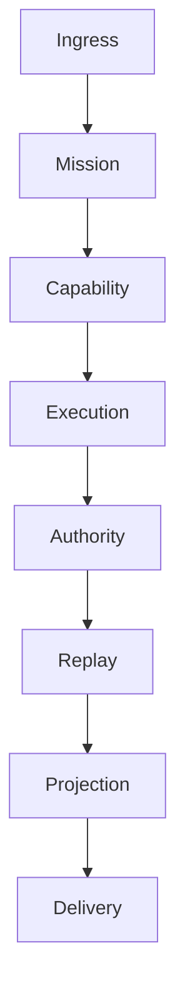
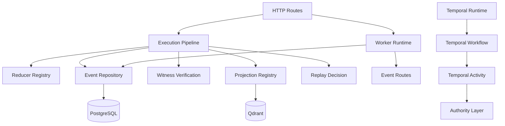

# ORCHESTRATION DEPENDENCY GRAPH

## Purpose
This document records the observed execution graph for the current OmniRoute orchestration layer and highlights where routing is direct, duplicated, implicit, or bypassed.

## Canonical flow

## Observed runtime graph

## Edge inventory
| Producer | Consumer | Transport | Authority boundary | Persistence boundary | Replay boundary | Projection boundary |
|---|---|---|---|---|---|---|
| HTTP gateway | Execution pipeline | REST | Yes | Yes | Partial | Partial |
| Execution pipeline | Reducer registry | In-process | Yes | No | Partial | No |
| Execution pipeline | Event repository | SQL transaction | Yes | Yes | Partial | No |
| Event routes | Worker runtime | HTTP polling | Partial | Yes | Partial | Partial |
| Runtime execution | Adapter layer | Function call | Yes | Adapter boundary | Partial | Partial |
| Capability registry | Provider/adapter selection | In-process mapping | Yes | No | Partial | No |
| Temporal scheduler | Workflow/activity | Temporal client | Partial | Yes | Partial | No |

## Routing anomalies
- Circular routing: not observed in the active path; the current shape is a hub-and-spoke orchestration model centered on the gateway and runtime.
- Duplicate routing: Temporal, worker polling, reducer dispatch, and direct event routes all carry execution responsibility, but none is the single authoritative route.
- Hidden routing: capability mapping is present in [gateway/technology_authority.js](gateway/technology_authority.js) and [gateway/mcp_registry.js](gateway/mcp_registry.js), but the active path still reaches infrastructure directly.
- Implicit routing: projection and replay are not always the direct result of a single authoritative contract; side effects are spread across route, pipeline, and worker layers.
- Runtime shortcuts: direct PostgreSQL access from [gateway/bootstrap/main.js](gateway/bootstrap/main.js) and direct route-based execution in [gateway/routes/events.js](gateway/routes/events.js) bypass the cleaner authority/adapter path.
- Kernel bypasses: the frozen kernel is conceptually present, but the active orchestration layer still invokes concrete implementations before fully crossing an authority boundary.

## Architectural conclusion
The system has multiple plausible execution paths, but no single immutable orchestrator path. That makes long-term replaceability harder than it should be.
