# System Diagrams

**Version:** 2.0
**Purpose:** Complete system architecture diagrams

---

## Constitutional Layer Architecture

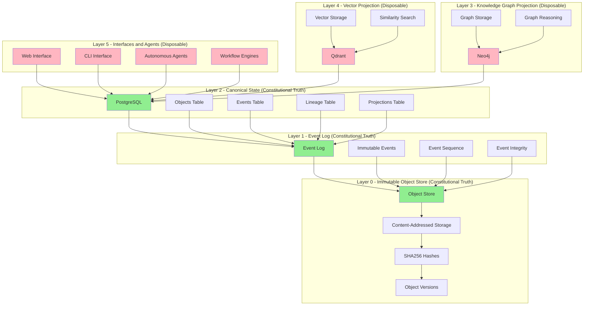

---

## Data Flow Architecture

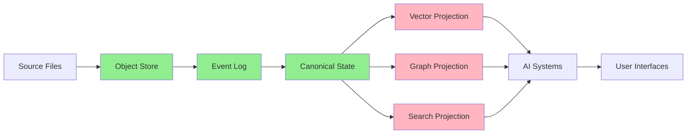

---

## Replay Architecture

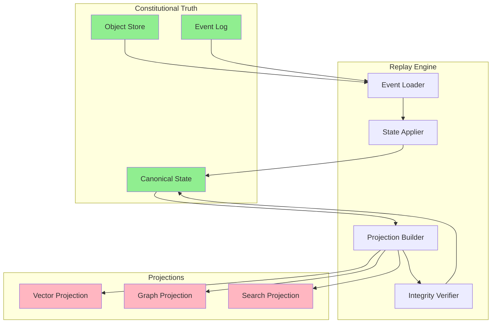

---

## Lineage Architecture

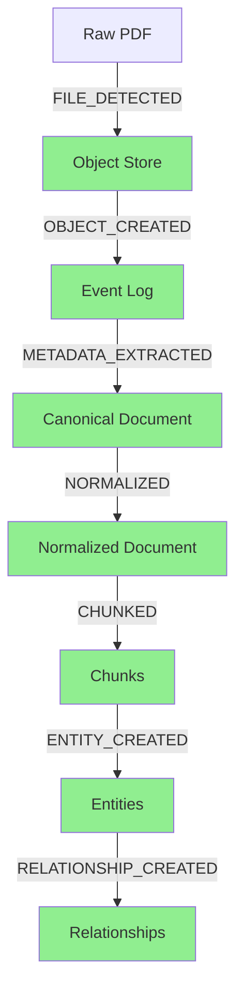

---

## Processing Pipeline Architecture

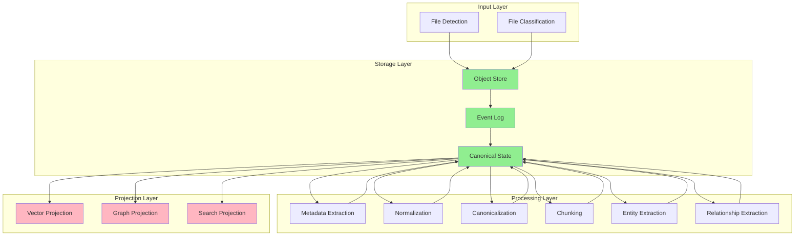

---

## Backup Architecture

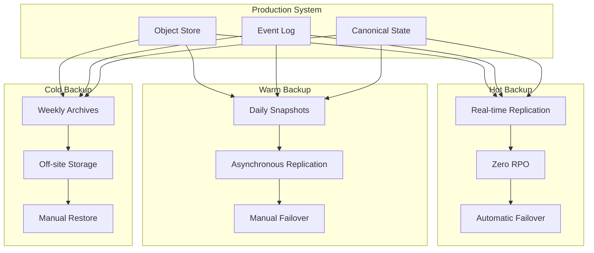

---

## Disaster Recovery Architecture

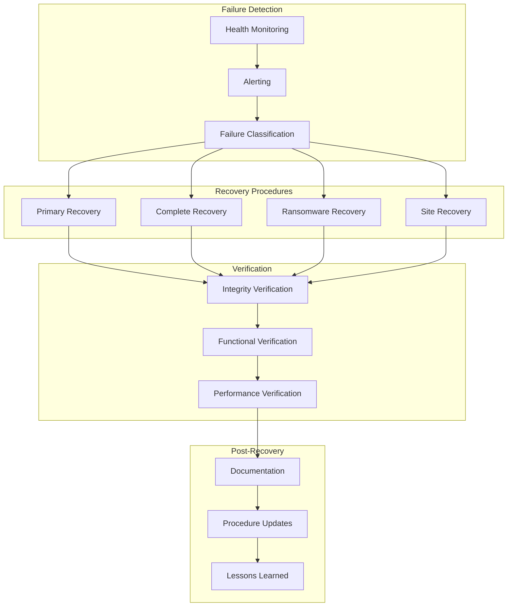

---

## Migration Architecture

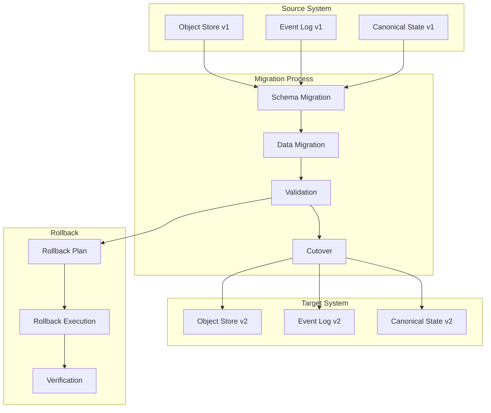

---

## Projection Architecture

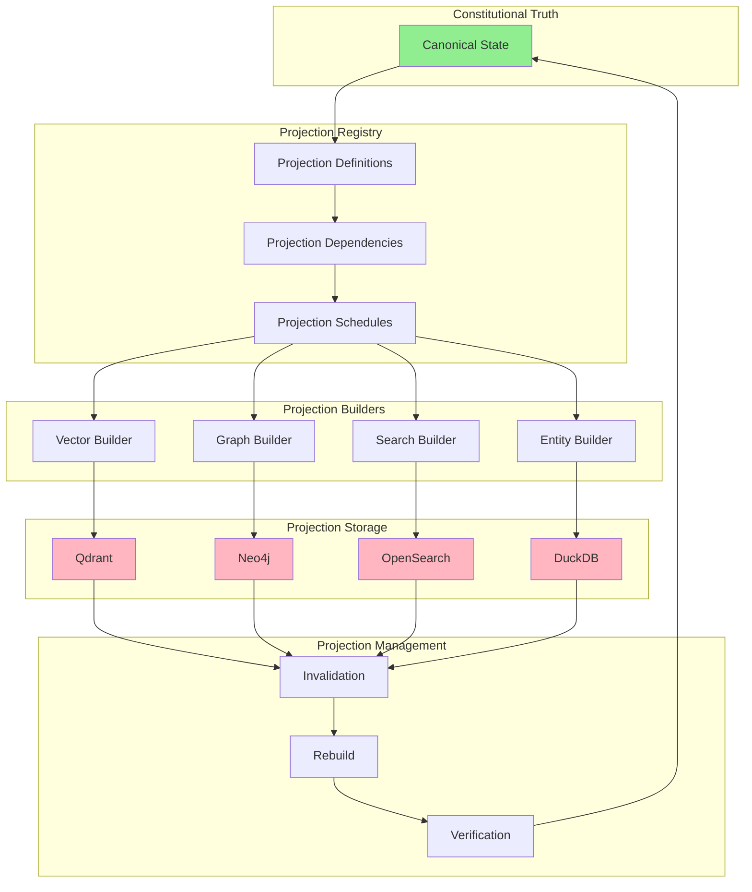

---

## Security Architecture

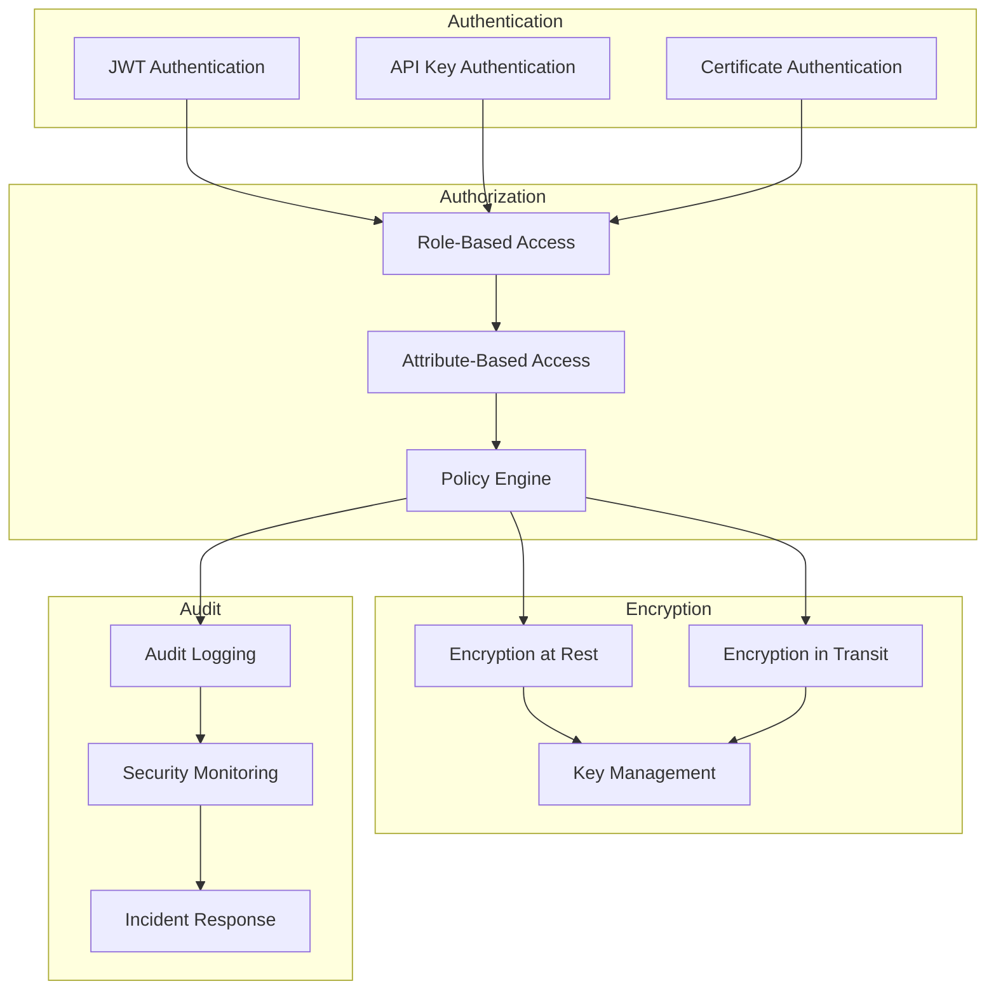

---

## Monitoring Architecture

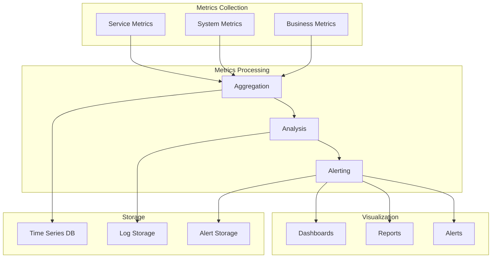

---

## Future AI Integration Architecture

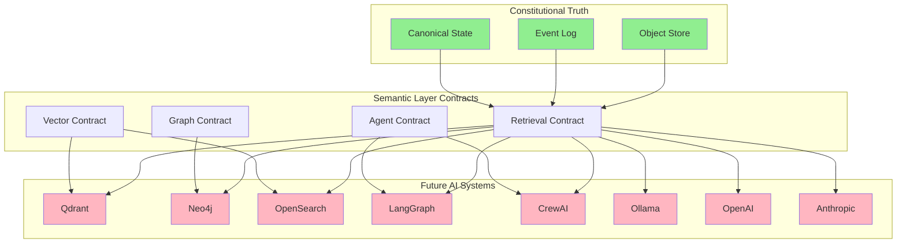
