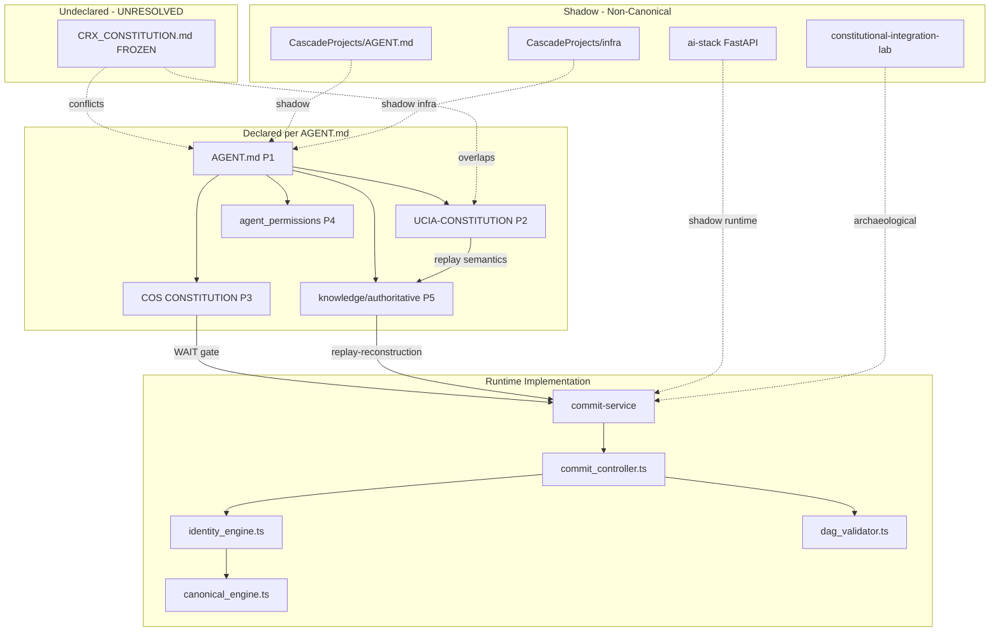

# Authority Conflicts v2

**Generated:** 2026-06-07  
**Audit:** CRX Layer 0B — Sovereignty Stabilization (Read-Only)  
**Canonical Root:** `C:\Users\nolan\CRX`  
**Classification key:** FACT | INFERENCE | UNKNOWN

---

## Executive Finding

**FACT:** At least five distinct authority layers claim jurisdiction over CRX, with one undeclared supreme document (`CRX_CONSTITUTION.md`) that postdates the declared hierarchy in `AGENT.md`.

**INFERENCE:** Layer 1 implementation planning is blocked until a single constitutional reconciliation amendment resolves CONFLICT-ROOT-001.

---

## Declared Authority Hierarchy (AGENT.md)

| Priority | Document | Scope | Classification |
|----------|----------|-------|----------------|
| 1 | `AGENT.md` | Agent execution, infra, audit | **FACT** — declared CANONICAL |
| 2 | `knowledge/authoritative/UCIA-CONSTITUTION-v1.0.md` | Kernel primitives, replay semantics | **FACT** |
| 3 | `vos/cos/CONSTITUTION.md` | Engineering process, WAIT default | **FACT** |
| 4 | `agents/agent_permissions.md` | Agent permission matrix | **FACT** |
| 5 | `knowledge/authoritative/*` | Domain specs | **FACT** |

**FACT:** `AGENT.md` does not reference `CRX_CONSTITUTION.md`.

---

## Undeclared Authority

| Document | Status | Modified | Classification |
|----------|--------|----------|----------------|
| `CRX_CONSTITUTION.md` | FROZEN Phase 3.5A | 2026-06-07 | **FACT** |
| Claims | Supersedes "all informal kernel descriptions" for extraction/implementation conformance | **FACT** |
| Amendment | Requires COS amendment process | **FACT** (text reference) |

**UNKNOWN:** Whether `CRX_CONSTITUTION.md` is intended to supersede `AGENT.md`, sit below UCIA, or replace UCIA entirely.

---

## Conflict Register

### CONFLICT-ROOT-001: Dual Constitutional Roots

| Field | AGENT.md | CRX_CONSTITUTION.md |
|-------|----------|---------------------|
| Position | Declared P1 supreme for agents | Root-level FROZEN kernel spec |
| Listed in other doc? | No mention of CRX_CONSTITUTION | No mention of AGENT.md hierarchy |
| Replay law | Via UCIA (P2) | 8 axioms incl. Replay Determinism (Axiom 4) |
| Witness | Not primary focus | Axiom 8; witness is verification not origin |
| Canonicalization | Not specified as authority split | Owned by Identity authority; not independent jurisdiction |
| Policy | Implied via governance | Axiom 5 — Policy Primacy on Mutation |

**Severity:** CRITICAL  
**Resolution status:** UNRESOLVED — report only

---

### CONFLICT-UCIA-001: Primitive Model Divergence

| Dimension | UCIA-CONSTITUTION v1.0 | CRX_CONSTITUTION 3.5A |
|-----------|------------------------|------------------------|
| Core primitives | Assertions, Relations, Evaluators | Actor, Artifact, Identity, Lineage, Event, Policy, Witness facts |
| Ontology | Graph of assertions/relations | Authority-separated root facts |
| Replay model | Evaluator-driven over assertion graph | Minimum replay set + deterministic reconstruction |
| Witness | **UNKNOWN** explicit authority | Witness facts required; witness authority absorbed |

**FACT:** Both are marked authoritative in different hierarchy positions.  
**INFERENCE:** UCIA and CRX_CONSTITUTION describe overlapping but non-isomorphic ontologies.

---

### CONFLICT-COS-001: Process vs Kernel Freeze

| Source | Claim | Classification |
|--------|-------|----------------|
| `vos/cos/CONSTITUTION.md` | Default state WAIT; 8-stage gate before execution | **FACT** |
| `CRX_CONSTITUTION.md` | FROZEN — implementation must conform | **FACT** |
| `runtime/commit-service` | Boots HTTP commit path without policy gate | **FACT** |

**INFERENCE:** Active runtime violates COS WAIT default and CRX_CONSTITUTION Policy Primacy (no policy engine).

---

### CONFLICT-RUNTIME-001: Implementation vs Constitutional Separation

| CRX_CONSTITUTION Law | Runtime Observation | Classification |
|----------------------|---------------------|----------------|
| Canonicalization owned by Identity; separate from fingerprinting | `identity_engine.ts` imports `canonicalize` and hashes inline | **FACT** — coupling |
| Witness is verification not origin | No witness module in runtime | **FACT** — absent |
| Recording ≠ Reconstruction | `commit_controller.ts` records and derives identity in one HTTP handler | **FACT** — coupling |
| Policy Primacy on Mutation | No policy check before `storeArtifact` | **FACT** — absent |

---

### CONFLICT-SCHEMA-001: Competing Event / State Models

| Schema / DDL | Location | Role |
|--------------|----------|------|
| `claim.schema.json` | CRX/knowledge/authoritative | Claim lifecycle |
| `decision.schema.json` | CRX/knowledge/authoritative | Decision lifecycle |
| `ledger_schema.sql` | CRX/runtime (3 tables) | Active runtime DDL |
| `init-db.sql` | CascadeProjects/infra (events, policy_evaluations, lineage_chains, replay_snapshots) | Shadow infra DDL |
| `canonical-event-envelope.json` | constitutional-integration-lab/extracted | Extracted envelope |
| `audit-event.schema.json` | vos/cos/schema + extracted copy | Governance audit |
| `foundational-primitives.json` | CascadeProjects + extracted | Shadow primitives |

**FACT:** `AGENT.md` states one canonical event envelope target; ≥6 event/state shapes exist.  
**Severity:** HIGH

---

### CONFLICT-SHADOW-001: Duplicate AGENT.md

| Primary | Shadow | Classification |
|---------|--------|----------------|
| `CRX/AGENT.md` (13,529 bytes) | `CascadeProjects/AGENT.md` (7,050 bytes) | **FACT** — per AUTHORITY_CONFLICT_REPORT.md |

---

### CONFLICT-REPLAY-001: Replay Spec vs Runtime Data Model

| replay-reconstruction.md | commit-service runtime |
|--------------------------|------------------------|
| Assertions + Relations tables | artifacts + lineage_edges |
| `replay_constitutional_state(timestamp)` | No replay function |
| Graph traversal by assertion_time | `created_at TIMESTAMP DEFAULT NOW()` |

**FACT:** Replay spec ontology does not match active DDL.  
**INFERENCE:** Replay against current runtime schema would require translation layer not specified.

---

## Authority Dependency Graph

---

## Authority Ownership Matrix

| Authority Domain | Declared Owner | Observed Owner | Drift |
|------------------|----------------|----------------|-------|
| Agent behavior | AGENT.md | AGENT.md | NONE |
| Kernel axioms | UCIA + CRX_CONSTITUTION | Both — conflict | **CRITICAL** |
| Engineering process | COS | COS docs only | NONE (docs) |
| Identity assignment | CRX_CONSTITUTION → Identity | identity_engine.ts (hash) | HIGH |
| Canonicalization | CRX_CONSTITUTION → Identity phase | canonical_engine.ts (standalone file) | MEDIUM |
| Lineage validation | CRX_CONSTITUTION → Lineage | dag_validator.ts (immediate parents only) | MEDIUM |
| Event recording | CRX_CONSTITUTION → Event | event_log.ts | PARTIAL |
| Policy gating | CRX_CONSTITUTION Axiom 5 | **NONE** | CRITICAL |
| Replay | UCIA + replay-reconstruction | **NONE executable** | CRITICAL |
| Witness | CRX_CONSTITUTION Axiom 8 | **NONE executable** | CRITICAL |
| Infrastructure | AGENT.md → CRX/infra (target) | CascadeProjects/infra (actual compose) | HIGH |

---

## Contradiction Summary Table

| ID | Parties | Nature | Severity |
|----|---------|--------|----------|
| ROOT-001 | AGENT.md vs CRX_CONSTITUTION.md | Dual supreme roots | CRITICAL |
| UCIA-001 | UCIA vs CRX_CONSTITUTION | Ontology mismatch | HIGH |
| COS-001 | COS WAIT vs runtime boot | Process violation | HIGH |
| RUNTIME-001 | Constitution vs commit-service | Layer coupling | HIGH |
| SCHEMA-001 | AGENT.md vs 6+ schemas | Event model drift | HIGH |
| SHADOW-001 | CRX vs CascadeProjects AGENT | Duplicate authority | CRITICAL |
| REPLAY-001 | replay-reconstruction vs DDL | Model mismatch | HIGH |

---

## Layer 1 Planning Gate

**INFERENCE:** The following must be reconciled before Layer 1 implementation (not resolved here):

1. Single constitutional root document or explicit precedence rule including `CRX_CONSTITUTION.md`
2. UCIA primitives vs CRX_CONSTITUTION authorities — mapping or supersession
3. Single event envelope and DDL source of truth
4. Infra canonical path (`CRX/infra/` vs CascadeProjects)
5. Witness authority: absorbed (CRX_CONSTITUTION) vs modules in JS.txt archive

**FACT:** No files were modified during this audit.
