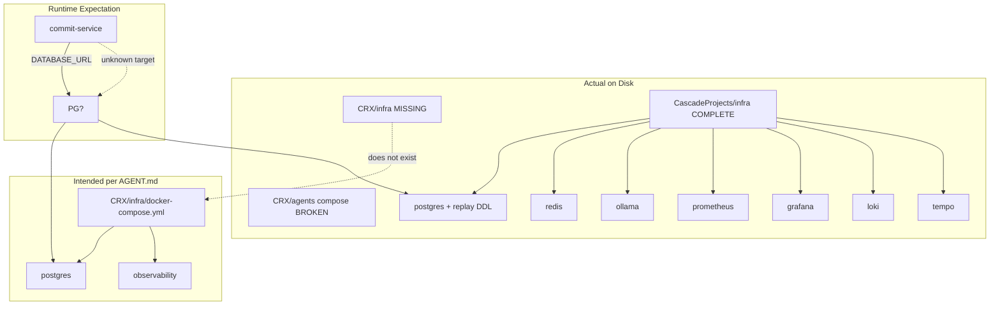

# Infrastructure Sovereignty Report

**Generated:** 2026-06-07  
**Audit:** CRX Layer 0B — Infrastructure Sovereignty (Read-Only)  
**Law:** No services started. No Docker invoked for boot.

---

## Executive Finding

**FACT:** Docker client is installed; daemon is not running.  
**FACT:** The only **complete** constitutional infra stack definition exists in **shadow** location `CascadeProjects/infra/`.  
**FACT:** Canonical target `CRX/infra/` does **not** exist.  
**INFERENCE:** Infrastructure sovereignty is **inverted** — shadow exceeds canonical.

---

## Compose File Inventory

| # | Path | Services Defined | CRX-Related? | Status |
|---|------|------------------|--------------|--------|
| 1 | `CRX/agents/docker-compose.yml` | planner, refactor, documentation, governance agents | YES | **BROKEN** — bad volume mounts |
| 2 | `CascadeProjects/infra/docker-compose.yml` | postgres, redis, ollama, prometheus, grafana, loki, tempo | YES | **CONFIGURED** — not running |
| 3 | `AppData/Local/hermes/hermes-agent/docker-compose.yml` | Hermes agent | NO | Third-party |
| 4 | `.../hermes-agent/docker-compose.windows.yml` | Hermes Windows | NO | Third-party |
| 5 | `.../matrix_xsign_bootstrap/docker-compose.yml` | Hermes e2e test | NO | Third-party |

---

## Service Definition Matrix

### CRX/agents/docker-compose.yml

| Service | Image/Build | Ports | Volumes | Constitutional Fit |
|---------|-------------|-------|---------|-------------------|
| planner-agent | Dockerfile.planner | — | `./authoritative` (MISSING) | LOW — agent scaffold |
| refactor-agent | Dockerfile.refactor | — | same | LOW |
| documentation-agent | Dockerfile.documentation | — | same | LOW |
| governance-agent | Dockerfile.governance | — | same | LOW |

**FACT:** Volume paths expect `agents/authoritative`, `agents/derived`, `agents/experimental` — actual paths are `CRX/knowledge/{authoritative,derived,experimental}`.  
**Classification:** SHADOW_RUNTIME — non-bootable without path fix.

---

### CascadeProjects/infra/docker-compose.yml

| Service | Image | Port | Volume | Healthcheck | Constitutional Fit |
|---------|-------|------|--------|-------------|-------------------|
| postgres | postgres:16-alpine | 5432 | ./volumes/postgres + init-db.sql | pg_isready | **HIGH** — event/lineage/replay DDL |
| redis | redis:7-alpine | 6379 | ./volumes/redis | redis-cli ping | MEDIUM — not used by runtime |
| ollama | ollama/ollama:latest | 11434 | ./volumes/ollama | none | MEDIUM — local inference |
| prometheus | prom/prometheus:latest | 9090 | config + data | none | MEDIUM — observability law |
| grafana | grafana/grafana:latest | 3000 | data | none | MEDIUM |
| loki | grafana/loki:latest | 3100 | config + data | none | MEDIUM |
| tempo | grafana/tempo:latest | 3200, 4317 | config + data | none | MEDIUM |

**Supporting configs (FACT):**

- `observability/prometheus.yml`
- `observability/loki-config.yml`
- `observability/tempo-config.yml`
- `scripts/init-db.sql` (157 lines — policy_evaluations, lineage_chains, replay_snapshots)
- `.env` (present — **location only, contents not read**)

---

## Stack Constitutional Alignment Score

| Requirement (from AGENT.md + CRX_CONSTITUTION) | CRX/agents compose | CascadeProjects compose | CRX/infra (missing) |
|-----------------------------------------------|-------------------|-------------------------|---------------------|
| Single canonical stack | NO | De facto only complete | Intended YES |
| PostgreSQL event substrate | NO | YES (rich DDL) | UNKNOWN |
| Replay snapshot support | NO | YES (replay_snapshots table) | UNKNOWN |
| Policy evaluation storage | NO | YES (policy_evaluations) | UNKNOWN |
| Redis (orchestration) | NO | YES | UNKNOWN |
| Ollama (local inference) | NO | YES | UNKNOWN |
| Observability (metrics/logs/traces) | NO | YES | UNKNOWN |
| Agent worker isolation | Attempted | NO | UNKNOWN |

**INFERENCE:** CascadeProjects stack is **closest to constitutional requirements** despite being non-canonical path.

---

## Component Sovereignty Table

| Component | Installed | Configured | Running | Canonical Location | Sovereignty |
|-----------|-----------|------------|---------|-------------------|-------------|
| Docker Engine | YES (29.5.2) | YES | **NO** | System | FRAGMENTED |
| Docker Compose | YES (plugin) | YES | NO | Multiple files | **SPLIT** |
| PostgreSQL | NO native | YES (shadow) | NO | CascadeProjects | SHADOW |
| Redis | NO native | YES (shadow) | NO | CascadeProjects | SHADOW |
| Ollama | NO native | YES (shadow image) | NO | CascadeProjects | SHADOW |
| Prometheus | NO | YES (shadow) | NO | CascadeProjects | SHADOW |
| Grafana | NO | YES (shadow) | NO | CascadeProjects | SHADOW |
| Loki | NO | YES (shadow) | NO | CascadeProjects | SHADOW |
| Tempo | NO | YES (shadow) | NO | CascadeProjects | SHADOW |
| WSL2 backend | YES | Ubuntu + docker-desktop | UNKNOWN | WSL | FACT |
| Node runtime | YES | commit-service | NO (not booted) | CRX/runtime | CANONICAL code |
| pino logger | YES | in commit-service | N/A | CRX/runtime | PARTIAL |

---

## Port Sovereignty (localhost probe)

| Port | Expected Service | Open | Classification |
|------|------------------|------|----------------|
| 5432 | PostgreSQL | NO | FACT |
| 6379 | Redis | NO | FACT |
| 11434 | Ollama | NO | FACT |
| 8080 | commit-service | NO | FACT |
| 3000 | Grafana | NO | FACT |
| 9090 | Prometheus | NO | FACT |
| 3100 | Loki | NO | FACT |
| 3200 | Tempo | NO | FACT |

**FACT:** No constitutional infra services are listening.

---

## DDL Sovereignty Conflict

| DDL | Location | Replay Tables | Policy Tables | Classification |
|-----|----------|---------------|---------------|----------------|
| ledger_schema.sql | CRX/runtime | NO | NO | CANONICAL code path |
| init-db.sql | CascadeProjects/infra | YES | YES | SHADOW — richer |

**INFERENCE:** Booting shadow postgres would create replay-ready schema; booting against runtime code uses poorer DDL — **split-brain risk**.

---

## Environment Dependencies (Implicit Infra)

| Dependency | Required By | Available | Classification |
|------------|-------------|-----------|----------------|
| DATABASE_URL | commit-service | Not in CRX tree | FACT |
| Node.js 22 | commit-service | YES | FACT |
| ts-node | commit-service dev | YES (local) | FACT |
| npm packages | commit-service | node_modules present | FACT |
| Git (3 sub-repos) | Lineage | YES | FACT |
| Windows filesystem | Paths | YES | FACT |

---

## Sovereignty Drift Diagram

---

## Critical Infrastructure Risks

| ID | Risk | Severity |
|----|------|----------|
| INF-SOV-001 | Complete stack only in shadow tree | CRITICAL |
| INF-SOV-002 | CRX/infra canonical path empty | HIGH |
| INF-SOV-003 | Broken agents compose misleads boot attempts | HIGH |
| INF-SOV-004 | DDL split between runtime and shadow init | HIGH |
| INF-SOV-005 | .env only in CascadeProjects | HIGH |
| INF-SOV-006 | Docker daemon stopped — false sense of readiness | MEDIUM |
| INF-SOV-007 | Ollama configured only in compose — never installed natively | MEDIUM |

---

## Layer 1 Infrastructure Planning Gate

**INFERENCE** (not executed):

1. Declare whether `CascadeProjects/infra` is migration source or quarantine
2. Create `CRX/infra/` only via amendment — not in this audit
3. Reconcile `init-db.sql` vs `ledger_schema.sql` before any postgres boot
4. Never start compose without constitutional DDL decision

**FACT:** No infrastructure created, started, or modified.
