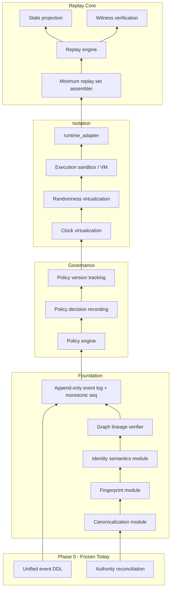

# Replay Readiness Gap Analysis

**Generated:** 2026-06-07  
**Audit:** CRX Layer 0B — Replay Readiness (Read-Only)  
**Law:** Replay implementation is frozen. Gaps identified only.

---

## Replay Specification Inventory

### Primary Specifications (Canonical Docs)

| Document | Location | Role | Classification |
|----------|----------|------|----------------|
| replay-reconstruction.md | CRX/knowledge/authoritative | Core replay algorithm (assertions/relations) | FACT |
| UCIA-CONSTITUTION-v1.0.md | CRX/knowledge/authoritative | Replay as civilization primitive | FACT |
| CRX_CONSTITUTION.md | CRX root | Axioms 4, 7, 8; minimum replay set | FACT |
| minimal-kernel-reconstruction.md | knowledge/authoritative | Kernel replay scope | FACT |
| fact/decision/rule-reconstruction.md | knowledge/authoritative | Domain reconstruction | FACT |
| evaluator-upgrade-protocol.md | knowledge/authoritative | Evaluator replay sensitivity | FACT |
| constitutional-state-hash-model.md | knowledge/authoritative | State hash at replay boundary | FACT |
| persistence-constitution.md | knowledge/authoritative | Persistence replay rules | FACT |
| derived/universal-replay-semantics.md | knowledge/derived | Cross-platform replay | FACT |
| derived/replay-verification-model.md | knowledge/derived | Verification model | FACT |
| derived/replay-sufficiency-proof.md | knowledge/derived | Sufficiency argument | FACT |
| derived/multi-generational-replay.md | knowledge/derived | Long-horizon replay | FACT |

### Forensic / Audit Specifications

| Document | Location |
|----------|----------|
| replay_truth_audit.md | CRX/reports/ |
| replay_critical_authority_map.md | CRX/reports/ |
| REPLAY_GAP_REPORT.md | CRX/reports/ |
| replay-boundary.md | CRX/inventory/ |
| integration-lab/reports/replay_criticality_report.md | Shadow |
| integration-lab/reports/replay_kernel_stabilization.md | Shadow |

### Archived Executable Specifications

| Asset | Location | Classification |
|-------|----------|----------------|
| JS.txt (421 KB) | Documents/Codex/2026-05-31/.../crx/JS.txt | FACT — archaeological |
| deterministic_replay_harness.js | JS.txt + integration-lab/extracted/js_txt/ | FACT — not in runtime |
| merkle_anchor_replay_verifier.js | JS.txt + extracted | FACT — forensic: dangerous to import |
| execution_integrity_auditor.js | JS.txt + extracted | FACT — inspirational |
| canonical_fingerprint_service.js | JS.txt + extracted | FACT — pure, reusable |
| formal_invariant_graph_verifier.js | JS.txt + extracted | FACT — pure, reusable |

---

## Executable Component Status

| Component | Specified | Implemented (CRX runtime) | Archived (JS.txt) | Gap |
|-----------|-----------|---------------------------|-------------------|-----|
| Replay engine | YES | NO | partial harness | **CRITICAL** |
| Double execution | YES | NO | harness dep | **CRITICAL** |
| Witness generation | YES | NO | merkle modules | **CRITICAL** |
| Witness verification | YES | NO | merkle_anchor_replay_verifier | **CRITICAL** |
| VM / sandbox isolation | YES | NO | runtime_adapter (dep) | **CRITICAL** |
| Clock virtualization | YES | NO | NO | **CRITICAL** |
| Randomness virtualization | YES | NO | NO | **HIGH** |
| Schema version gate | YES | NO | NO | **HIGH** |
| Policy re-evaluation at replay | YES (CRX_CONSTITUTION) | NO | NO | **CRITICAL** |
| Monotonic event counter | Implied | NO | NO | **HIGH** |
| Graph lineage replay | YES | NO | partial verifier | **HIGH** |
| State projection | YES | NO | NO | **HIGH** |
| Canonicalization | YES | YES (naive) | YES (robust JS) | PARTIAL |
| Fingerprinting | YES | YES (coupled) | YES (separate JS) | PARTIAL |
| Lineage DAG verify | YES | YES (minimal) | YES (formal verifier) | PARTIAL |
| Event append log | YES | YES (partial schema) | YES (richer DDL in shadow) | PARTIAL |

---

## Ontology Gap: Spec vs Runtime

| Dimension | replay-reconstruction.md | commit-service runtime |
|-----------|--------------------------|------------------------|
| Core units | Assertions, Relations | artifacts JSONB, lineage_edges |
| Time model | assertion_time, relation_time | created_at DEFAULT NOW() |
| State output | 7 computed state fields | None |
| Storage query | Temporal graph traversal | CRUD inserts |
| Evaluators | Required | Absent |

**Classification:** FACT — active runtime is not a subset of replay spec; it is a parallel minimal commit API.

---

## Minimum Replay Set (CRX_CONSTITUTION) vs Available

| Required Element | Available? | Source |
|------------------|------------|--------|
| Content / artifacts | PARTIAL | artifact_store |
| Identity law version | NO | — |
| Identity assignments | PARTIAL | hash-as-id only |
| Lineage edges | PARTIAL | lineage_edges |
| Append-only events | PARTIAL | execution_events (weak schema) |
| Policy law per era | NO | — |
| Recorded policy decisions | NO | — |
| Claims | NO (runtime) | claim.schema.json only |
| Persisted witnesses | NO | — |

**INFERENCE:** Minimum replay set is **< 40% satisfiable** from current runtime substrate.

---

## Replay Dependency Chain (Required for Implementation)

**Classification:** INFERENCE — ordering derived from CRX_CONSTITUTION minimum replay set + forensic pre_infra_constitutional_freeze.md.

---

## Determinism Breakers (Current Environment)

| Breaker | Evidence | Severity |
|---------|----------|----------|
| No VM sandbox | commit-service runs bare Node/ts-node | CRITICAL |
| Wall-clock timestamps | ledger_schema.sql DEFAULT NOW() | HIGH |
| No schema versioning | No version field in commits | HIGH |
| Identity=hash | Cross-domain collision risk | HIGH |
| Silent artifact dedup | ON CONFLICT DO NOTHING | MEDIUM |
| External PostgreSQL | Unknown managed instance | UNKNOWN |
| Node/float/JSON ordering | Environment-dependent serialization edge cases | MEDIUM |

---

## Archived Module Dependency Chain (JS.txt)

**FACT** per forensic verdict and integration-lab registry:

| Module | Depends On | Safe to Extract? |
|--------|------------|------------------|
| canonical_fingerprint_service.js | None | YES (pure) |
| formal_invariant_graph_verifier.js | None | YES (pure) |
| deterministic_replay_harness.js | plugin_execution_scheduler, runtime_adapter | NO — deps unmapped |
| execution_integrity_auditor.js | Finalized event schema, execution trace | NO |
| merkle_anchor_replay_verifier.js | External anchor inputs | NO — dangerous |

---

## Gap Severity Summary

| Category | Gaps | Readiness |
|----------|------|-----------|
| Specification coverage | Extensive (12+ docs) | **READY** (as reference) |
| Executable replay | 0 modules | **NOT READY** |
| Substrate alignment | Ontology mismatch | **NOT READY** |
| Pure authority modules | 2 extractable from archive | **PARTIAL** |
| Infrastructure for offline replay | None running | **NOT READY** |
| Policy + witness | Fully absent | **NOT READY** |

---

## Layer 1 Entry Conditions (Planning)

**INFERENCE:** Before replay implementation (post-freeze lift):

1. Resolve CONFLICT-ROOT-001 and REPLAY-001 (ontology)
2. Freeze observed behavior of 12 TS files OR replace via amendment
3. Unify DDL: shadow `init-db.sql` vs `ledger_schema.sql` decision
4. Extract pure modules to quarantine (not runtime) first
5. Establish monotonic event law before harness

**FACT:** No replay code written. No services started.
