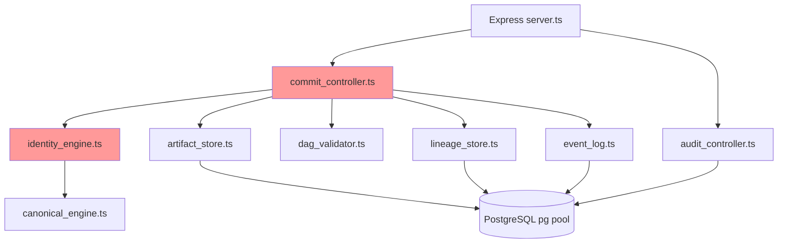

# Runtime Boundary Report

**Generated:** 2026-06-07  
**Audit:** CRX Layer 0B — Runtime Boundary (Read-Only)  
**Scope:** `C:\Users\nolan\CRX\runtime` (+ shadow comparison only)

---

## Constitutional Layer Model (Target)

Per `CRX_CONSTITUTION.md` and forensic reports:

| Layer | Must Be Pure | Must Not Own |
|-------|--------------|--------------|
| Canonicalization | Normalization | Hashing, transport |
| Fingerprinting | Hashing | Identity semantics |
| Identity | Semantic assignment | Transport, persistence truth |
| Lineage | DAG validation | Replay execution |
| Event | Append-only recording | Reconstruction |
| Policy | Mutation authorization | Raw occurrence |
| Replay | Deterministic reconstruction | Recording |
| Witness | Attestation verification | Content origin |
| Transport | I/O adapter | Constitutional derivation |
| Persistence | Storage | Constitutional truth (events are truth) |

---

## Active Runtime Surface

**FACT:** Single service: `runtime/kernel/commit-service`  
**FACT:** 12 TypeScript files, 1 SQL DDL  
**FACT:** Entrypoint: `server.ts` → Express :8080

### File Responsibility Map

| File | Declared Role | Actual Authorities Exercised |
|------|---------------|-------------------------------|
| `server.ts` | HTTP bootstrap | Transport |
| `api/commit_controller.ts` | Commit endpoint | Transport + Identity + Lineage + Orchestration |
| `api/audit_controller.ts` | Audit endpoint | Transport + Persistence read |
| `engines/canonical_engine.ts` | Canonicalization | Canonicalization (pure) |
| `engines/identity_engine.ts` | Identity (misnamed) | Canonicalization + Fingerprinting |
| `validation/dag_validator.ts` | Lineage | Lineage (partial — local parents only) |
| `events/event_log.ts` | Events | Persistence + Event |
| `persistence/artifact_store.ts` | Storage | Persistence |
| `persistence/lineage_store.ts` | Storage | Persistence |
| `persistence/db.ts` | DB pool | Infrastructure coupling |
| `persistence/ledger_schema.sql` | DDL | Persistence truth leakage |
| `utils/logger.ts` | Logging | Observability (minimal) |

---

## Violation Register

### RBV-001: Transport Owns Identity Derivation

**Location:** `commit_controller.ts` lines 13–17  
**FACT:**

```typescript
const artifactId = computeCanonicalHash(artifact)
const parentIds = lineage?.parents || []
validateLineage(parentIds, artifactId)
```

**Leakage:** HTTP handler computes constitutional identity before any kernel service boundary.  
**Constitutional refs:** CRX_CONSTITUTION Axiom 7 (recording ≠ reconstruction); forensic VIOLATION-001  
**Severity:** HIGH  
**Classification:** FACT

---

### RBV-002: Identity Collapses Into Fingerprinting

**Location:** `identity_engine.ts`  
**FACT:** Function named `computeCanonicalHash` performs canonicalize → JSON.stringify → SHA-256.  
**Leakage:** No domain namespace, no artifact type in identity law, no separation of semantic identity from byte hash.  
**Constitutional refs:** CRX_CONSTITUTION Identity authority; forensic VIOLATION-003  
**Severity:** HIGH

---

### RBV-003: Fingerprinting Collapses Into Canonicalization

**Location:** `identity_engine.ts` line 2 — imports `canonicalize`  
**Leakage:** Cannot swap normalization law without modifying hash engine.  
**Constitutional refs:** CRX_CONSTITUTION — canonicalization is Identity phase, not independent; implementation invariant still requires separable modules  
**Severity:** MEDIUM

---

### RBV-004: No Policy Gate on Mutation

**Location:** `commit_controller.ts` — direct `storeArtifact` after validation  
**FACT:** No policy evaluation, no policy_version, no recorded decision.  
**Constitutional refs:** CRX_CONSTITUTION Axiom 5; COS WAIT default  
**Severity:** CRITICAL

---

### RBV-005: Event Log Decoupled From Artifact Commit

**Location:** `event_log.ts`  
**FACT:** Inserts `execution_events` without `artifact_id` FK enforcement in application code; schema allows null `artifact_id`.  
**Leakage:** Event substrate may not form coherent replay chain.  
**Severity:** MEDIUM

---

### RBV-006: Persistence DDL Grants Truth Authority

**Location:** `ledger_schema.sql`  
**FACT:** Relational constraints and `ON CONFLICT DO NOTHING` in `artifact_store.ts` silently drop duplicate commits.  
**Leakage:** Database behavior becomes constitutional truth, not append-only event semantics.  
**Constitutional refs:** forensic VIOLATION-002  
**Severity:** MEDIUM

---

### RBV-007: Lineage Validation Is Non-Graph

**Location:** `dag_validator.ts`  
**FACT:** Only checks: (a) child not in parent list, (b) no duplicate parents.  
**Missing:** Ancestor cycle detection, parent existence verification, cross-artifact DAG walk.  
**Severity:** MEDIUM  
**Classification:** FACT

---

### RBV-008: Replay and Witness Absent

**FACT:** No replay module, harness, or witness verifier in runtime tree.  
**Constitutional refs:** UCIA replay semantics; CRX_CONSTITUTION Axioms 4, 8  
**Severity:** CRITICAL (by design — replay frozen)

---

### RBV-009: Time Non-Determinism

**FACT:** `ledger_schema.sql` uses `DEFAULT NOW()` on timestamps.  
**FACT:** No logical clock or monotonic sequence in application layer.  
**Replay impact:** Ordering by wall clock — determinism breaker  
**Severity:** HIGH

---

## Coupling Matrix

| Component A | Component B | Coupling Type | Constitutional? |
|-------------|-------------|---------------|-----------------|
| commit_controller | identity_engine | Direct import | NO |
| commit_controller | dag_validator | Direct import | NO |
| commit_controller | artifact_store | Direct import | NO |
| identity_engine | canonical_engine | Direct import | PARTIAL (constitution allows phase coupling) |
| event_log | db pool | Infrastructure | YES (acceptable if bounded) |
| artifact_store | PostgreSQL ON CONFLICT | Silent drop | NO |

---

## Shadow Runtime Comparison

| Boundary | CRX commit-service | ai-stack FastAPI | Classification |
|----------|-------------------|------------------|----------------|
| Transport | Express | FastAPI | FACT |
| Policy gate | None | None | FACT |
| Identity | Hash of body | Auto-increment ID | FACT — different model |
| Lineage | Optional parents array | None | FACT |
| Canonical? | YES | NO | INFERENCE |

---

## Dependency Graph (Observed)



**Red nodes:** constitutional logic in transport-adjacent path.

---

## Replay / Identity / Lineage / Policy Coupling Summary

| Concern | Coupled To | Verdict |
|---------|------------|---------|
| Identity | Transport (HTTP handler) | **VIOLATION** |
| Identity | Fingerprinting (same function) | **VIOLATION** |
| Lineage | Transport (same handler) | **VIOLATION** |
| Policy | Nothing (absent) | **VIOLATION** |
| Replay | Persistence schema only (assumed) | **GAP** |
| Witness | Nothing | **GAP** |

---

## Layer 1 Boundary Targets (Planning — Not Implementation)

**INFERENCE:** Minimum decoupling for constitutional conformance:

1. Kernel service layer between transport and identity/lineage
2. Policy evaluation hook before persistence
3. Separate fingerprint module from identity semantics
4. Monotonic event sequencer
5. Graph-level lineage validator
6. No `ON CONFLICT DO NOTHING` without recorded policy event

**FACT:** No code changes made in this audit.
