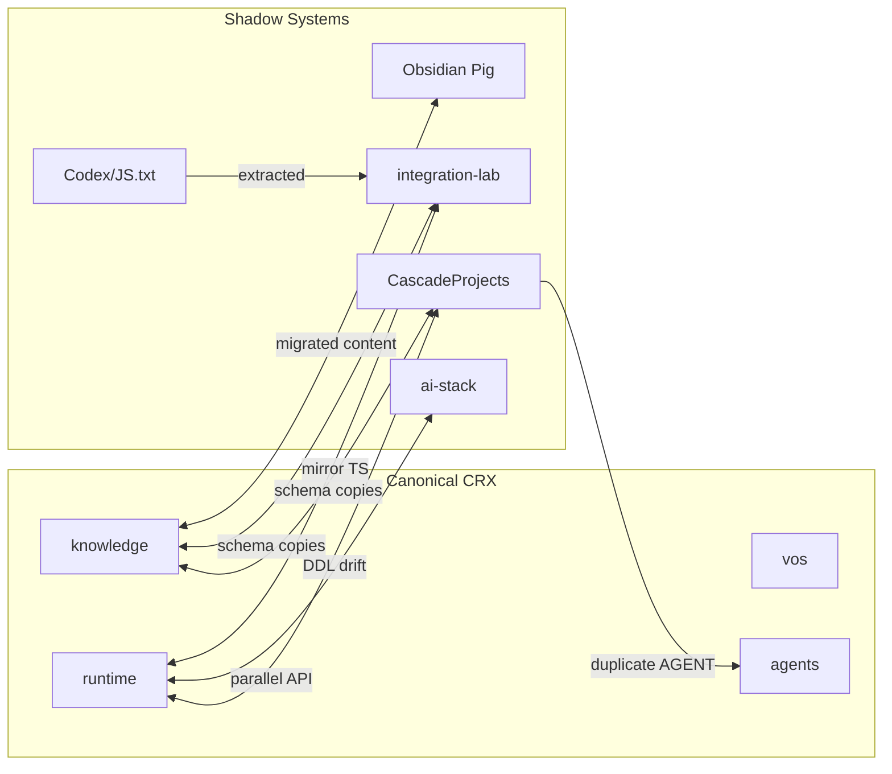

# Shadow System Map

**Generated:** 2026-06-07  
**Audit:** CRX Layer 0B — Repository Sovereignty (Read-Only)  
**Canonical Root:** `C:\Users\nolan\CRX`

---

## Sovereignty Model

```text
CANONICAL (FACT — user-declared)
└── C:\Users\nolan\CRX
    ├── knowledge/   [.git master, no remote]
    ├── vos/         [.git main, no remote]
    ├── runtime/     [.git → github.com/ngesk2/crx-runtime]
    ├── agents/      [no .git]
    ├── reports/     [forensic record]
    └── inventory/   [discovery artifacts]

SHADOW (discovery sources — NOT authority)
├── CascadeProjects/
├── constitutional-integration-lab/
├── ai-stack/
├── Documents/Codex/
└── Downloads/Pig/
```

---

## Repository Root Verification

| Path | Is Git Repo | Remote | Canonical? | Classification |
|------|-------------|--------|------------|----------------|
| `C:\Users\nolan\CRX` | NO | — | **YES** (filesystem root) | FACT |
| `CRX/knowledge` | YES | None | Partial (docs) | FACT |
| `CRX/vos` | YES | None | Partial (governance) | FACT |
| `CRX/runtime` | YES | ngesk2/crx-runtime | Partial (code) | FACT |
| `CascadeProjects` | NO | — | NO | FACT |
| `constitutional-integration-lab` | NO | — | NO | FACT |
| `ai-stack` | NO | — | NO | FACT |
| `Documents/Codex` | NO | — | NO | FACT |
| `Downloads/Pig` | NO | — | NO (cognition only) | FACT |

**INFERENCE:** CRX is a **filesystem assembly** of three git sub-repos without a parent `.git`. This is structural sovereignty debt.

---

## Shadow System Registry

### SHADOW-01: CascadeProjects

| Attribute | Value | Classification |
|-----------|-------|----------------|
| Path | `C:\Users\nolan\CascadeProjects` | FACT |
| Origin | Agent-generated during repository confusion | FACT (per REPOSITORY_PROVENANCE_MAP.md) |
| Git | None | FACT |
| File count | ~38 | FACT |

| Component | Canonical Equivalent | Relationship |
|-----------|---------------------|--------------|
| `AGENT.md` | `CRX/AGENT.md` | DUPLICATE — different content/size |
| `infra/docker-compose.yml` | `CRX/infra/` (missing) | SHADOW — only complete stack |
| `infra/.env` | None in CRX | SHADOW — secrets location |
| `infra/scripts/init-db.sql` | `runtime/.../ledger_schema.sql` | DUPLICATE — different DDL |
| `schemas/foundational-primitives.json` | knowledge schemas | DUPLICATE |
| `kernel/`, `replay/`, `events/` | CRX/runtime, knowledge | SCAFFOLD — mostly README |
| `constitutional-extraction-lab/` | constitutional-integration-lab | DUPLICATE lab |

**Risk:** CRITICAL — agents may bootstrap infra or authority from wrong tree.

---

### SHADOW-02: constitutional-integration-lab

| Attribute | Value | Classification |
|-----------|-------|----------------|
| Path | `C:\Users\nolan\constitutional-integration-lab` | FACT |
| Role | Extraction archaeology, JS.txt copies, comparisons | INFERENCE |
| Git | None | FACT |

| Component | Canonical Equivalent | Relationship |
|-----------|---------------------|--------------|
| `extracted/runtime/` | `CRX/runtime/kernel/commit-service/` | MIRROR |
| `extracted/js_txt/*.js` | `Documents/Codex/.../JS.txt` | EXTRACTED COPY (59 modules) |
| `extracted/schemas/*` | CRX/knowledge + vos schemas | AGGREGATED COPY |
| `inventories/crx_repository_inventory.md` | CRX/inventory/ | PARALLEL AUDIT |
| `comparisons/*.md` | CRX/reports/ | PARALLEL FORENSICS |

**Risk:** MEDIUM — safe as quarantine if never promoted to runtime without amendment.

---

### SHADOW-03: ai-stack

| Attribute | Value | Classification |
|-----------|-------|----------------|
| Path | `C:\Users\nolan\ai-stack` | FACT |
| Files | `api/main.py`, `python-env/Dockerfile` | FACT |
| Title in code | "CRX Memory Engine" | FACT |

| Component | Canonical Equivalent | Relationship |
|-----------|---------------------|--------------|
| POST `/event` | POST `/kernel/commit` | PARALLEL API |
| SQLAlchemy events | PostgreSQL execution_events | DUPLICATE concept |

**FACT:** `main.py` imports `db`, `models` — companion files not present in tree (2 files total).  
**Risk:** HIGH — incomplete shadow runtime with CRX branding.

---

### SHADOW-04: Documents/Codex

| Attribute | Value | Classification |
|-----------|-------|----------------|
| Path | `C:\Users\nolan\Documents\Codex` | FACT |
| Files | 56 | FACT |
| Key asset | `JS.txt` (421,359 bytes) | FACT |

**Classification:** ARCHAEOLOGICAL — not runtime authority.  
**Risk:** MEDIUM — inspirational replay modules may be mistaken for canonical.

---

### SHADOW-05: Downloads/Pig (Obsidian)

| Attribute | Value | Classification |
|-----------|-------|----------------|
| Path | `C:\Users\nolan\Downloads\Pig` | FACT |
| CRX content | Stale `CRX_KnowledgeOS/` refs in workspace.json (21 paths) | FACT |
| Live CRX knowledge | Migrated to `CRX/knowledge/` | INFERENCE |

**Risk:** LOW-MEDIUM — stale editor paths mislead agents.

---

### SHADOW-06: hermes-agent (Third-Party)

| Attribute | Value | Classification |
|-----------|-------|----------------|
| Path | `AppData/Local/hermes/hermes-agent/` | FACT |
| Compose files | 3 docker-compose variants | FACT |
| CRX relation | None identified | INFERENCE |

**Classification:** UNRELATED third-party — exclude from CRX sovereignty.

---

## Canonical vs Shadow File Duplication

### By Basename (Known Duplicates)

| Filename | Canonical Location | Shadow Location(s) |
|----------|-------------------|-------------------|
| `AGENT.md` | `CRX/` | `CascadeProjects/` |
| `docker-compose.yml` | `CRX/agents/` (broken) | `CascadeProjects/infra/` (full) |
| `foundational-primitives.json` | — | `CascadeProjects/schemas/`, `integration-lab/extracted/schemas/` |
| `claim.schema.json` | `CRX/knowledge/authoritative/` | `integration-lab/extracted/schemas/` |
| `decision.schema.json` | `CRX/knowledge/authoritative/` | `integration-lab/extracted/schemas/` |
| `argument-graph.schema.json` | `CRX/vos/cos/schema/` | `integration-lab/extracted/schemas/` |
| `audit-event.schema.json` | `CRX/vos/cos/schema/` | `integration-lab/extracted/schemas/` |
| `server.ts` + kernel TS | `CRX/runtime/.../src/` | `integration-lab/extracted/runtime/` |
| `init-db.sql` | — (runtime has `ledger_schema.sql`) | `CascadeProjects/infra/scripts/`, `integration-lab/extracted/schemas/` |
| `canonical-event-envelope.json` | `CascadeProjects/events/` | `integration-lab/extracted/schemas/` |

### DDL Divergence (Critical)

| Source | Tables | Classification |
|--------|--------|----------------|
| `runtime/.../ledger_schema.sql` | artifacts, lineage_edges, execution_events | **FACT** — active runtime |
| `CascadeProjects/.../init-db.sql` | events, policy_evaluations, lineage_chains, replay_snapshots, ... | **FACT** — shadow, richer replay schema |

**INFERENCE:** Shadow DDL is closer to constitutional replay requirements than active runtime DDL.

---

## Ownership Conflict Map



---

## Sovereignty Recommendations (Planning Only — Not Executed)

| Action | Type | Classification |
|--------|------|----------------|
| Quarantine CascadeProjects from agent default paths | Planning | INFERENCE |
| Treat integration-lab as read-only extraction | Planning | INFERENCE |
| Mark ai-stack as non-canonical experiment | Planning | INFERENCE |
| Unify git at CRX root | Planning | UNKNOWN timing |
| Resolve stale Obsidian refs | Planning | LOW priority |

**FACT:** No repositories modified during this audit.
