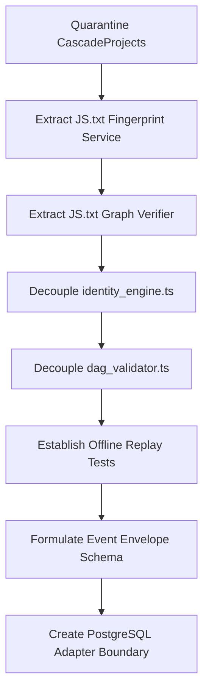

# Authority Migration Graph
**Version:** Pre-Replay Execution  
**Classification:** Forensics (Read-Only)

This document outlines the safest order for migrating authorities to prevent system instability.

---

## Migration Steps

### Dependency and Risk Map

1. **Step 1: Quarantine CascadeProjects**
   - Prerequisites: None.
   - Risk: Low.
2. **Step 2: Extract Fingerprint Service**
   - Prerequisites: Step 1.
   - Risk: Medium (requires verifying that computed hashes do not break existing database primary key expectations).
3. **Step 3: Extract Graph Verifier**
   - Prerequisites: Step 2.
   - Risk: Low.
4. **Step 4: Decouple identity_engine.ts & dag_validator.ts**
   - Prerequisites: Step 3.
   - Risk: High (requires refactoring the HTTP commit controller to remove direct calls).\n